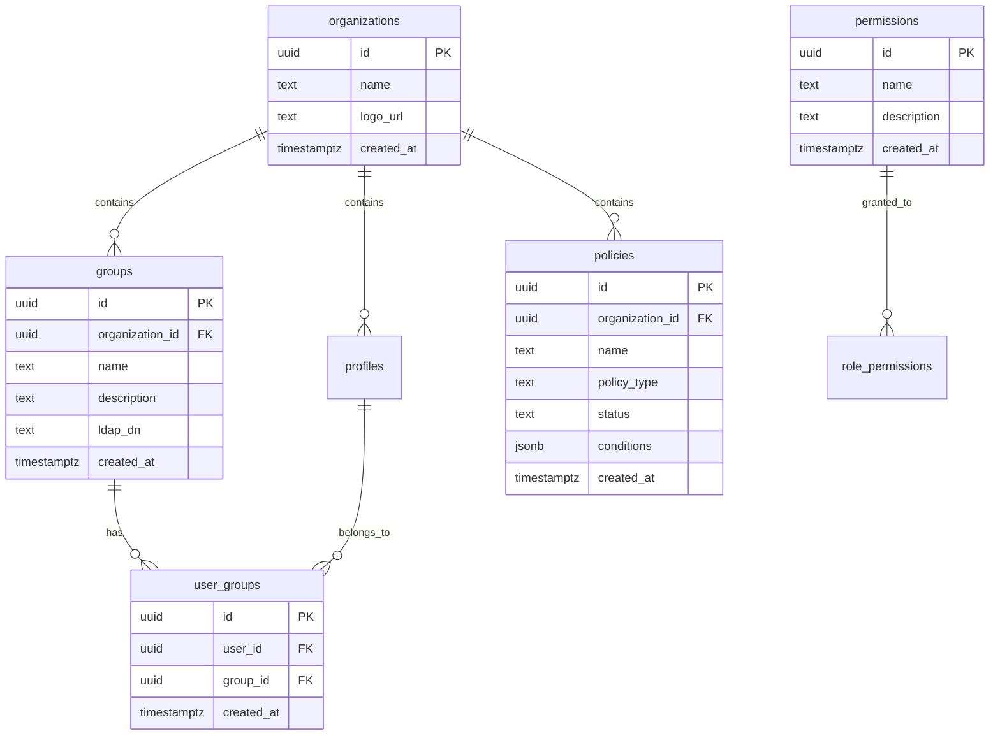

## Overview

The organizations schema manages multi-tenant organization structures, group hierarchies, and permission systems.

## Tables

### organizations

Core organization/tenant records.

```sql Schema
CREATE TABLE public.organizations (
  id UUID PRIMARY KEY DEFAULT uuid_generate_v4(),
  name TEXT NOT NULL,
  logo_url TEXT,
  created_at TIMESTAMP WITH TIME ZONE DEFAULT NOW()
);
```

#### Columns

<ParamField path="id" type="UUID">
  Organization unique identifier (auto-generated)
</ParamField>

<ParamField path="name" type="TEXT" required>
  Organization name
</ParamField>

<ParamField path="logo_url" type="TEXT">
  URL to organization logo image
</ParamField>

<ParamField path="created_at" type="TIMESTAMPTZ">
  Organization creation timestamp
</ParamField>

#### Example Query

```sql Get Organization
SELECT * FROM organizations WHERE id = 'org-uuid';
```

### groups

User groups for access control and permissions.

```sql Schema
CREATE TABLE public.groups (
  id UUID PRIMARY KEY DEFAULT gen_random_uuid(),
  organization_id UUID NOT NULL REFERENCES public.organizations(id) ON DELETE CASCADE,
  name TEXT NOT NULL,
  description TEXT,
  ldap_dn TEXT,
  created_at TIMESTAMPTZ DEFAULT now()
);
```

#### Columns

<ParamField path="id" type="UUID">
  Group unique identifier
</ParamField>

<ParamField path="organization_id" type="UUID" required>
  Organization this group belongs to
</ParamField>

<ParamField path="name" type="TEXT" required>
  Group name
</ParamField>

<ParamField path="description" type="TEXT">
  Group description or purpose
</ParamField>

<ParamField path="ldap_dn" type="TEXT">
  LDAP Distinguished Name for LDAP-synced groups
</ParamField>

<ParamField path="created_at" type="TIMESTAMPTZ">
  Group creation timestamp
</ParamField>

#### Example Queries

```sql Create Group
INSERT INTO groups (organization_id, name, description)
VALUES (
  'org-uuid',
  'Engineering',
  'Engineering team members'
)
RETURNING *;
```

```sql List Organization Groups
SELECT * FROM groups
WHERE organization_id = 'org-uuid'
ORDER BY name;
```

### user_groups

User membership in groups (many-to-many relationship).

```sql Schema
CREATE TABLE public.user_groups (
  id UUID PRIMARY KEY DEFAULT gen_random_uuid(),
  user_id UUID NOT NULL REFERENCES public.profiles(id) ON DELETE CASCADE,
  group_id UUID NOT NULL REFERENCES public.groups(id) ON DELETE CASCADE,
  created_at TIMESTAMPTZ DEFAULT now(),
  UNIQUE(user_id, group_id)
);
```

#### Columns

<ParamField path="id" type="UUID">
  Membership record ID
</ParamField>

<ParamField path="user_id" type="UUID" required>
  User ID from profiles table
</ParamField>

<ParamField path="group_id" type="UUID" required>
  Group ID
</ParamField>

<ParamField path="created_at" type="TIMESTAMPTZ">
  Membership creation timestamp
</ParamField>

#### Constraints

- **Unique constraint:** `(user_id, group_id)` - Prevents duplicate memberships

#### Example Queries

```sql Add User to Group
INSERT INTO user_groups (user_id, group_id)
VALUES ('user-uuid', 'group-uuid')
ON CONFLICT (user_id, group_id) DO NOTHING;
```

```sql Get User's Groups
SELECT g.* 
FROM groups g
JOIN user_groups ug ON ug.group_id = g.id
WHERE ug.user_id = 'user-uuid';
```

```sql Get Group Members
SELECT p.id, p.full_name, p.role
FROM profiles p
JOIN user_groups ug ON ug.user_id = p.id
WHERE ug.group_id = 'group-uuid'
ORDER BY p.full_name;
```

### permissions

System-wide permission definitions.

```sql Schema
CREATE TABLE public.permissions (
  id UUID PRIMARY KEY DEFAULT gen_random_uuid(),
  name TEXT NOT NULL UNIQUE,
  description TEXT,
  created_at TIMESTAMPTZ DEFAULT now()
);
```

#### Columns

<ParamField path="id" type="UUID">
  Permission unique identifier
</ParamField>

<ParamField path="name" type="TEXT" required>
  Permission name (unique, e.g., `resources:read`, `users:write`)
</ParamField>

<ParamField path="description" type="TEXT">
  Permission description
</ParamField>

<ParamField path="created_at" type="TIMESTAMPTZ">
  Permission creation timestamp
</ParamField>

#### Common Permissions

```sql Seed Permissions
INSERT INTO permissions (name, description) VALUES
  ('resources:read', 'View resources'),
  ('resources:write', 'Create and update resources'),
  ('resources:delete', 'Delete resources'),
  ('users:read', 'View users'),
  ('users:write', 'Create and update users'),
  ('groups:read', 'View groups'),
  ('groups:write', 'Manage groups'),
  ('devices:read', 'View devices'),
  ('devices:manage', 'Manage device enrollment');
```

### role_permissions

Maps roles to permissions.

```sql Schema
CREATE TABLE public.role_permissions (
  id UUID PRIMARY KEY DEFAULT gen_random_uuid(),
  role TEXT NOT NULL,
  permission_id UUID NOT NULL REFERENCES public.permissions(id) ON DELETE CASCADE,
  created_at TIMESTAMPTZ DEFAULT now(),
  UNIQUE(role, permission_id)
);
```

#### Columns

<ParamField path="id" type="UUID">
  Role permission mapping ID
</ParamField>

<ParamField path="role" type="TEXT" required>
  Role name (e.g., `global_admin`, `org_admin`, `user`)
</ParamField>

<ParamField path="permission_id" type="UUID" required>
  Permission ID
</ParamField>

<ParamField path="created_at" type="TIMESTAMPTZ">
  Mapping creation timestamp
</ParamField>

#### Example Queries

```sql Grant Permission to Role
INSERT INTO role_permissions (role, permission_id)
SELECT 'org_admin', id FROM permissions WHERE name = 'resources:write';
```

```sql Get Role Permissions
SELECT p.name, p.description
FROM permissions p
JOIN role_permissions rp ON rp.permission_id = p.id
WHERE rp.role = 'org_admin';
```

### policies

Dynamic Zero Trust access policies.

```sql Schema
CREATE TABLE public.policies (
  id UUID PRIMARY KEY DEFAULT gen_random_uuid(),
  organization_id UUID NOT NULL REFERENCES public.organizations(id) ON DELETE CASCADE,
  name TEXT NOT NULL,
  description TEXT,
  policy_type TEXT NOT NULL DEFAULT 'access',
  status TEXT NOT NULL DEFAULT 'draft',
  conditions JSONB DEFAULT '[]'::jsonb,
  applies_to INTEGER DEFAULT 0,
  created_at TIMESTAMPTZ DEFAULT now(),
  updated_at TIMESTAMPTZ DEFAULT now()
);
```

#### Columns

<ParamField path="id" type="UUID">
  Policy unique identifier
</ParamField>

<ParamField path="organization_id" type="UUID" required>
  Organization this policy belongs to
</ParamField>

<ParamField path="name" type="TEXT" required>
  Policy name
</ParamField>

<ParamField path="description" type="TEXT">
  Policy description
</ParamField>

<ParamField path="policy_type" type="TEXT" default="access">
  Policy type: `access`, `device_trust`, `network`, etc.
</ParamField>

<ParamField path="status" type="TEXT" default="draft">
  Policy status: `draft`, `active`, `disabled`
</ParamField>

<ParamField path="conditions" type="JSONB">
  Policy conditions as JSON array
</ParamField>

<ParamField path="applies_to" type="INTEGER">
  Count of resources/users this policy applies to
</ParamField>

<ParamField path="created_at" type="TIMESTAMPTZ">
  Policy creation timestamp
</ParamField>

<ParamField path="updated_at" type="TIMESTAMPTZ">
  Last update timestamp
</ParamField>

#### Conditions Format

```json Example Conditions
[
  {
    "type": "device_trust",
    "operator": "equals",
    "value": "high"
  },
  {
    "type": "user_group",
    "operator": "in",
    "value": ["group-uuid-1", "group-uuid-2"]
  },
  {
    "type": "time_window",
    "operator": "between",
    "value": {"start": "09:00", "end": "17:00"}
  }
]
```

#### Triggers

**`update_policies_updated_at`** - Automatically updates `updated_at` timestamp:

```sql Trigger
CREATE TRIGGER update_policies_updated_at
BEFORE UPDATE ON public.policies
FOR EACH ROW
EXECUTE FUNCTION public.update_updated_at_column();
```

## Row Level Security

### organizations

```sql RLS Policies
-- Users can view their own organization
CREATE POLICY "Users can view their own organization"
ON public.organizations FOR SELECT
USING (
  EXISTS (
    SELECT 1 FROM public.profiles
    WHERE profiles.id = auth.uid()
    AND profiles.organization_id = organizations.id
  )
);

-- Global admins can view all organizations
CREATE POLICY "Global admins can view all organizations"
ON public.organizations FOR SELECT
USING (
  EXISTS (
    SELECT 1 FROM public.profiles
    WHERE profiles.id = auth.uid()
    AND profiles.role = 'global_admin'
  )
);

-- Global admins can create organizations
CREATE POLICY "Global admins can insert organizations"
ON public.organizations FOR INSERT
WITH CHECK (
  EXISTS (
    SELECT 1 FROM public.profiles
    WHERE profiles.id = auth.uid()
    AND profiles.role = 'global_admin'
  )
);
```

### groups

```sql RLS Policies
-- Users can view groups in their org
CREATE POLICY "Users can view groups in their org"
ON public.groups FOR SELECT
USING (
  organization_id IN (
    SELECT organization_id FROM public.profiles WHERE id = auth.uid()
  )
);

-- Admins can manage groups
CREATE POLICY "Admins can manage groups in their org"
ON public.groups FOR ALL
USING (
  organization_id IN (
    SELECT organization_id FROM public.profiles 
    WHERE id = auth.uid() AND role IN ('org_admin', 'global_admin')
  )
);
```

### user_groups

```sql RLS Policies
-- Users can view their own group memberships
CREATE POLICY "Users can view their group memberships"
ON public.user_groups FOR SELECT
USING (user_id = auth.uid());

-- Admins can manage user groups
CREATE POLICY "Admins can manage user groups"
ON public.user_groups FOR ALL
USING (
  EXISTS (
    SELECT 1 FROM profiles p1
    JOIN profiles p2 ON p1.organization_id = p2.organization_id
    WHERE p1.id = auth.uid() 
    AND p2.id = user_groups.user_id
    AND p1.role = ANY (ARRAY['org_admin'::user_role, 'global_admin'::user_role])
  )
);
```

### permissions

```sql RLS Policies
-- All authenticated users can view permissions
CREATE POLICY "All users can view permissions"
ON public.permissions FOR SELECT
TO authenticated USING (true);
```

### role_permissions

```sql RLS Policies
-- All users can view role permissions
CREATE POLICY "All users can view role permissions"
ON public.role_permissions FOR SELECT
USING (true);

-- Only global admins can manage
CREATE POLICY "Global admins can manage role permissions"
ON public.role_permissions FOR ALL
USING (get_user_role(auth.uid()) = 'global_admin'::user_role);
```

### policies

```sql RLS Policies
-- Admins can manage policies in their org
CREATE POLICY "Admins can manage policies in their org"
ON public.policies FOR ALL
USING (
  organization_id = get_user_org_id(auth.uid())
  AND get_user_role(auth.uid()) = ANY (ARRAY['org_admin'::user_role, 'global_admin'::user_role])
);

-- Users can view policies in their org
CREATE POLICY "Users can view policies in their org"
ON public.policies FOR SELECT
USING (organization_id = get_user_org_id(auth.uid()));
```

## Relationships



## Related Tables

- `profiles` - User profiles with organization membership
- `resources` - Resources owned by organizations
- `user_resource_access` - Access control via groups
