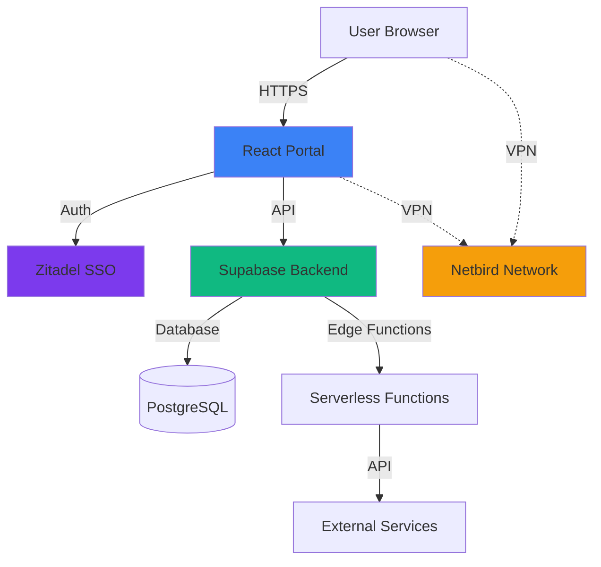
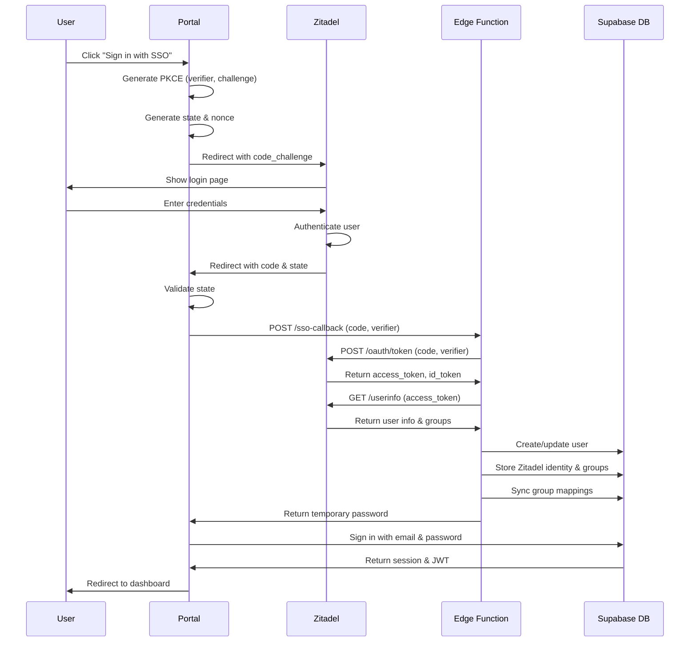
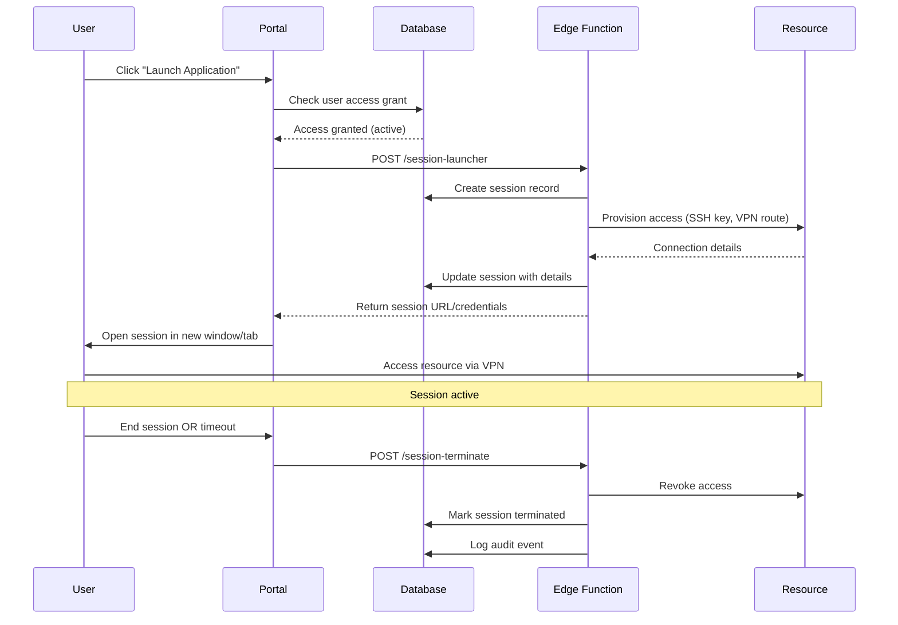

Nexus Access Vault implements a modern, cloud-native architecture designed for security, scalability, and maintainability. This document details the system's architecture, key components, and data flows.

## High-Level Architecture

<Frame>

</Frame>

The architecture follows a three-tier design:

1. **Presentation Layer**: React-based SPA with TypeScript
2. **Application Layer**: Supabase Edge Functions (Deno runtime)
3. **Data Layer**: PostgreSQL with Row Level Security (RLS)

## Core Components

### Frontend Application

<Card title="React SPA" icon="react">
  Single-page application built with React 18, TypeScript, and Vite for optimal performance and developer experience.
</Card>

**Technology Stack**:
- **Framework**: React 18.3 with concurrent features
- **Language**: TypeScript 5.8 with strict mode
- **Build Tool**: Vite 5.4 with SWC compiler
- **Routing**: React Router v6 with nested layouts
- **UI Library**: shadcn/ui + Radix UI primitives
- **Styling**: Tailwind CSS 3.4 with custom design system

**Key Files**:
- `src/App.tsx` - Application entry point with routing configuration
- `src/components/AuthProvider.tsx` - Authentication context and state management
- `src/components/AppSidebar.tsx` - Navigation with role-based rendering
- `src/hooks/useZitadelSSO.ts` - SSO authentication hook with PKCE

#### Component Architecture

The application follows a hierarchical component structure:

```typescript
App (QueryClientProvider, AuthProvider)
├── BrowserRouter
│   ├── Auth Pages (Login, Callback)
│   ├── MainLayout
│   │   ├── AppSidebar (Navigation)
│   │   ├── Dashboard
│   │   ├── MyApplications
│   │   ├── MyDevices
│   │   ├── Sessions
│   │   └── Admin Routes
│   │       ├── Users
│   │       ├── Groups
│   │       ├── Resources
│   │       └── Settings
│   └── Special Routes (Enrollment, NotFound)
```

See `src/App.tsx:36-81` for complete routing configuration.

#### State Management Strategy

<CardGroup cols={2}>
  <Card title="Server State" icon="server">
    React Query manages all server data with automatic caching, refetching, and synchronization.
  </Card>
  <Card title="Client State" icon="browser">
    React Context + hooks for authentication, theme, and UI state.
  </Card>
</CardGroup>

**Authentication State** (`src/components/AuthProvider.tsx`):

```typescript
const AuthContext = createContext<AuthContextType>({
  user: null,              // Supabase user object
  session: null,           // Active session with JWT
  profile: null,           // User profile with organization
  roles: [],               // Local role assignments
  zitadelIdentity: null,   // Zitadel groups and user ID
  loading: false,
  signOut: async () => {},
  hasRole: (role) => false,
  hasZitadelGroup: (group) => false,
});
```

The `AuthProvider` automatically:
- Listens to Supabase auth state changes
- Fetches user profile, roles, and Zitadel identity on login
- Provides helper functions for permission checking
- Manages sign-out and session cleanup

### Backend Services

<Card title="Supabase Platform" icon="database">
  Comprehensive backend-as-a-service providing PostgreSQL database, authentication, edge functions, and real-time subscriptions.
</Card>

#### PostgreSQL Database

**Database Schema** (`src/integrations/supabase/types.ts`):

The system uses a comprehensive relational schema with the following key tables:

<Accordion title="Core Tables">
  - **profiles**: User profiles with organization membership
  - **organizations**: Multi-tenant organization management
  - **user_roles**: Role assignments (many-to-many)
  - **user_groups**: Group memberships
  - **resources**: Applications and infrastructure resources
  - **user_resource_access**: Access grants with time bounds
</Accordion>

<Accordion title="Identity & Auth Tables">
  - **zitadel_configurations**: OIDC provider settings per organization
  - **user_zitadel_identities**: Links users to Zitadel accounts
  - **zitadel_group_mappings**: Maps Zitadel groups to local groups
  - **authentik_configurations**: Alternative SSO provider support
</Accordion>

<Accordion title="Infrastructure Tables">
  - **cloud_providers**: AWS, Azure, GCP credentials
  - **hypervisors**: VMware, Proxmox, KVM connections
  - **netbird_configurations**: VPN network settings
  - **devices**: Enrolled user devices
  - **sessions**: Active access sessions
</Accordion>

<Accordion title="Audit & Compliance">
  - **audit_logs**: Comprehensive event logging
  - **policies**: Access policies and rules
  - **enrollment_tokens**: Device enrollment tokens
</Accordion>

**Row Level Security (RLS)**:

All tables implement RLS policies to enforce organization-level data isolation:

```sql
-- Example: Users can only see resources in their organization
CREATE POLICY "Users see own org resources"
  ON resources FOR SELECT
  USING (
    organization_id IN (
      SELECT organization_id FROM profiles
      WHERE id = auth.uid()
    )
  );
```

#### Edge Functions

Serverless functions running on Deno for backend logic:

<CardGroup cols={2}>
  <Card title="zitadel-api" icon="key">
    Handles OIDC token exchange, userinfo retrieval, and group synchronization
  </Card>
  <Card title="device-enrollment" icon="laptop">
    Manages device registration and trust verification
  </Card>
  <Card title="session-launcher" icon="rocket">
    Provisions and launches resource access sessions
  </Card>
  <Card title="netbird-proxy" icon="network-wired">
    Proxies requests to Netbird API for VPN management
  </Card>
</CardGroup>

**Zitadel API Function** (`supabase/functions/zitadel-api/index.ts`):

This critical function handles the SSO callback flow:

```typescript
// Token exchange action
case 'sso-callback':
  // 1. Exchange authorization code for tokens
  const tokenResponse = await fetch(tokenEndpoint, {
    method: 'POST',
    body: new URLSearchParams({
      grant_type: 'authorization_code',
      code: authCode,
      code_verifier: codeVerifier,
      client_id: clientId,
      redirect_uri: redirectUri,
    }),
  });

  // 2. Fetch user information
  const userinfoResponse = await fetch(userinfoEndpoint, {
    headers: { Authorization: `Bearer ${accessToken}` },
  });

  // 3. Get user's Zitadel groups
  const groups = userInfo['urn:zitadel:iam:user:resourceowner:grants'] || [];

  // 4. Create/update user in Supabase
  const { data: authUser, error } = await supabase.auth.admin.createUser({
    email: userInfo.email,
    email_confirm: true,
    user_metadata: { full_name: userInfo.name },
  });

  // 5. Link Zitadel identity
  await supabase.from('user_zitadel_identities').upsert({
    user_id: authUser.id,
    zitadel_user_id: userInfo.sub,
    zitadel_groups: groups,
  });

  // 6. Sync groups to local groups (if enabled)
  if (config.sync_groups) {
    await syncZitadelGroups(authUser.id, groups);
  }
```

See `IMPLEMENTATION_SUMMARY.md:9-105` for complete authentication flow details.

### External Integrations

<CardGroup cols={3}>
  <Card title="Zitadel" icon="shield-check">
    OIDC identity provider for SSO authentication
  </Card>
  <Card title="Netbird" icon="network-wired">
    Mesh VPN for secure network connectivity
  </Card>
  <Card title="Headscale" icon="server">
    Self-hosted Tailscale control plane
  </Card>
</CardGroup>

#### Zitadel Integration

**Configuration** (`ZITADEL_NETBIRD_SETUP.md`):

Zitadel provides enterprise SSO with comprehensive OIDC support:

- **Issuer URL**: `https://manager.kappa4.com`
- **Client Type**: Public (PKCE)
- **Scopes**: `openid profile email urn:zitadel:iam:org:project:id:zitadel:aud`
- **Claims**: Groups/roles, organization ID, user metadata

**Authorization Flow**:

<Steps>
  <Step title="Initiate Login">
    User clicks "Sign in with Kappa4 Manager", portal generates PKCE parameters
  </Step>
  <Step title="Redirect to Zitadel">
    Browser redirects to Zitadel with code challenge and state
  </Step>
  <Step title="User Authentication">
    User authenticates at Zitadel (username/password, MFA, etc.)
  </Step>
  <Step title="Authorization Grant">
    Zitadel redirects back with authorization code
  </Step>
  <Step title="Token Exchange">
    Edge function exchanges code for tokens using code verifier
  </Step>
  <Step title="User Provisioning">
    Edge function creates/updates user and syncs groups
  </Step>
  <Step title="Local Sign-In">
    Frontend signs in with Supabase using temporary password
  </Step>
</Steps>

See `IMPLEMENTATION_SUMMARY.md:78-109` for detailed flow documentation.

#### Netbird VPN Integration

<Note>
  Netbird provides a WireGuard-based mesh VPN that eliminates the need for traditional VPN concentrators. Each device connects peer-to-peer with automatic NAT traversal.
</Note>

**Network Architecture**:

```
Internet
    │
    ├─── Netbird Management Server (manager.kappa4.com)
    │    └─── Coordination, ACLs, Device Registry
    │
    └─── Mesh Network (100.64.0.0/10)
         ├─── Portal Server (100.64.0.10)
         ├─── User Device 1 (100.64.0.25)
         ├─── User Device 2 (100.64.0.26)
         └─── Resource Server (100.64.0.50)
```

**Features**:
- Automatic peer discovery
- NAT traversal with STUN/TURN
- End-to-end encryption (WireGuard)
- Access control lists (ACLs)
- Network routes and DNS

**API Integration** (`supabase/functions/netbird-proxy`):

The portal proxies Netbird API requests for:
- Device enrollment and key management
- ACL synchronization based on user access grants
- Network route management
- DNS configuration

## Data Flow Diagrams

### Authentication Flow



### Resource Access Flow



### Group Synchronization Flow

When a user logs in via Zitadel SSO, their groups are automatically synchronized:

```typescript
async function syncZitadelGroups(userId: string, zitadelGroups: string[]) {
  // 1. Fetch group mappings
  const { data: mappings } = await supabase
    .from('zitadel_group_mappings')
    .select('zitadel_group, local_group_id')
    .in('zitadel_group', zitadelGroups);

  // 2. Map Zitadel groups to local groups
  const localGroupIds = mappings.map(m => m.local_group_id);

  // 3. Remove user from old groups
  await supabase
    .from('user_groups')
    .delete()
    .eq('user_id', userId);

  // 4. Add user to new groups
  await supabase
    .from('user_groups')
    .insert(localGroupIds.map(groupId => ({
      user_id: userId,
      group_id: groupId,
    })));

  // 5. Update last sync timestamp
  await supabase
    .from('user_zitadel_identities')
    .update({ last_synced: new Date().toISOString() })
    .eq('user_id', userId);
}
```

## Security Architecture

### Defense in Depth

The system implements multiple security layers:

<AccordionGroup>
  <Accordion title="Layer 1: Network Isolation">
    **VPN-Only Access**: Portal accessible only via Netbird VPN
    
    - Server binds to internal interface only
    - Firewall rules block external access
    - No public DNS records
    
    ```bash
    # Bind to Netbird interface only
    server: {
      host: "100.64.0.10",
      port: 8080,
    }
    ```
  </Accordion>

  <Accordion title="Layer 2: Authentication">
    **Multi-Factor SSO**: Zitadel OIDC with MFA enforcement
    
    - PKCE flow (SHA-256)
    - State parameter (CSRF protection)
    - Nonce parameter (replay protection)
    - Token rotation
    
    See `src/hooks/useZitadelSSO.ts` for implementation.
  </Accordion>

  <Accordion title="Layer 3: Authorization">
    **Role-Based + Group-Based Access Control**
    
    - Local roles: `global_admin`, `org_admin`, `support`, `user`
    - Zitadel groups: `admin`, `support`, `developers`, etc.
    - Combined checks for hybrid authorization
    
    ```typescript
    // Check both local role and Zitadel group
    const canAccessAdmin = 
      hasRole('org_admin') || hasZitadelGroup('admin');
    ```
    
    See `src/components/AppSidebar.tsx:54-90` for permission logic.
  </Accordion>

  <Accordion title="Layer 4: Data Isolation">
    **Row Level Security (RLS)**: PostgreSQL policies enforce data boundaries
    
    - Organization-level isolation
    - User can only see own organization's data
    - Admins restricted to their organization
    - Global admins see all (with policy exception)
  </Accordion>

  <Accordion title="Layer 5: Audit Logging">
    **Comprehensive Audit Trail**: All security events logged
    
    - Authentication attempts (success/failure)
    - Authorization decisions
    - Resource access grants/revocations
    - Administrative actions
    - Configuration changes
    
    Logs include: timestamp, user, IP, action, details, result.
  </Accordion>
</AccordionGroup>

### Security Best Practices

<Warning>
  **Production Deployment Checklist**:
  
  ✓ Deploy behind Netbird VPN only
  
  ✓ Configure firewall to block external access
  
  ✓ Enable MFA in Zitadel for all users
  
  ✓ Rotate service account tokens quarterly
  
  ✓ Review audit logs weekly
  
  ✓ Keep all dependencies updated
  
  ✓ Use HTTPS with valid certificates
  
  ✓ Implement backup and disaster recovery
</Warning>

## Deployment Architecture

### Development Environment

```bash
# Local development with hot reload
npm run dev

# Environment variables (.env)
VITE_SUPABASE_URL="https://your-project.supabase.co"
VITE_SUPABASE_PUBLISHABLE_KEY="your-anon-key"
VITE_ZITADEL_ISSUER_URL="https://manager.kappa4.com"
VITE_ZITADEL_CLIENT_ID="your-client-id"
VITE_ZITADEL_REDIRECT_URI="http://localhost:8080/auth/callback"
VITE_NETWORK_MODE="development"
```

### Production Environment

<Steps>
  <Step title="Build Application">
    ```bash
    npm run build
    # Output: dist/ directory with optimized assets
    ```
  </Step>
  <Step title="Deploy to Server">
    ```bash
    # Copy dist/ to server
    scp -r dist/* user@server:/var/www/portal/
    ```
  </Step>
  <Step title="Configure Web Server">
    ```nginx
    server {
      listen 100.64.0.10:8080;
      server_name portal.internal;
      
      root /var/www/portal;
      index index.html;
      
      location / {
        try_files $uri $uri/ /index.html;
      }
    }
    ```
  </Step>
  <Step title="Configure Firewall">
    ```bash
    # Allow only Netbird network
    sudo ufw allow from 100.64.0.0/10 to 100.64.0.10 port 8080
    sudo ufw deny 8080
    ```
  </Step>
</Steps>

### Infrastructure Components

<CardGroup cols={2}>
  <Card title="Application Server" icon="server">
    **Specs**: 2 CPU, 4GB RAM, 20GB SSD
    
    **Software**: Nginx, Node.js (build only)
    
    **Network**: Netbird client connected
  </Card>
  <Card title="Database Server" icon="database">
    **Platform**: Supabase Cloud or Self-Hosted
    
    **Specs**: PostgreSQL 15, 4GB RAM minimum
    
    **Backup**: Daily automated backups
  </Card>
  <Card title="Identity Provider" icon="shield">
    **Platform**: Zitadel at manager.kappa4.com
    
    **Config**: OIDC application with PKCE
    
    **MFA**: Enforced for all users
  </Card>
  <Card title="VPN Infrastructure" icon="network-wired">
    **Platform**: Netbird management server
    
    **Network**: 100.64.0.0/10 address space
    
    **Encryption**: WireGuard end-to-end
  </Card>
</CardGroup>

## Scalability Considerations

### Horizontal Scaling

The architecture supports horizontal scaling at multiple levels:

- **Frontend**: Static assets served via CDN (future)
- **Edge Functions**: Auto-scale based on load (Supabase)
- **Database**: Read replicas for query distribution
- **VPN**: Mesh architecture scales with devices

### Performance Optimizations

<CardGroup cols={2}>
  <Card title="Code Splitting" icon="scissors">
    React lazy loading and route-based chunking reduce initial bundle size
  </Card>
  <Card title="React Query Cache" icon="database">
    Intelligent caching reduces API calls and improves UX
  </Card>
  <Card title="Database Indexing" icon="bolt">
    Indexes on foreign keys and frequently queried columns
  </Card>
  <Card title="Connection Pooling" icon="arrows-spin">
    Supabase Pooler for efficient database connections
  </Card>
</CardGroup>

## Monitoring & Observability

### Logging Strategy

<Tabs>
  <Tab title="Application Logs">
    - Browser console (development)
    - Sentry or similar (production)
    - Error boundaries for graceful failures
  </Tab>
  <Tab title="Edge Function Logs">
    ```bash
    # View real-time logs
    supabase functions logs zitadel-api --tail
    
    # Filter by error level
    supabase functions logs zitadel-api --level error
    ```
  </Tab>
  <Tab title="Database Logs">
    - Slow query log (> 1 second)
    - Connection pool metrics
    - RLS policy violations
  </Tab>
  <Tab title="Audit Logs">
    - All security events in `audit_logs` table
    - Queryable via admin interface
    - Exportable for SIEM integration
  </Tab>
</Tabs>

## Future Architecture Enhancements

<CardGroup cols={2}>
  <Card title="Microservices" icon="cubes">
    Split monolithic edge functions into specialized microservices
  </Card>
  <Card title="Event Bus" icon="rss">
    Implement event-driven architecture for real-time updates
  </Card>
  <Card title="GraphQL API" icon="diagram-project">
    Add GraphQL layer for flexible client queries
  </Card>
  <Card title="Multi-Region" icon="globe">
    Deploy across multiple regions for global availability
  </Card>
</CardGroup>

## Related Documentation

<CardGroup cols={2}>
  <Card title="Features Overview" icon="star" href="/features">
    Explore all system capabilities and features
  </Card>
  <Card title="Getting Started" icon="rocket" href="/getting-started/installation">
    Deploy your first instance
  </Card>
  <Card title="Configuration Guide" icon="gear" href="/deployment/environment-variables">
    Configure SSO, VPN, and integrations
  </Card>
  <Card title="Database Schema" icon="table" href="/api/schema/authentication">
    Complete database schema reference
  </Card>
</CardGroup>
