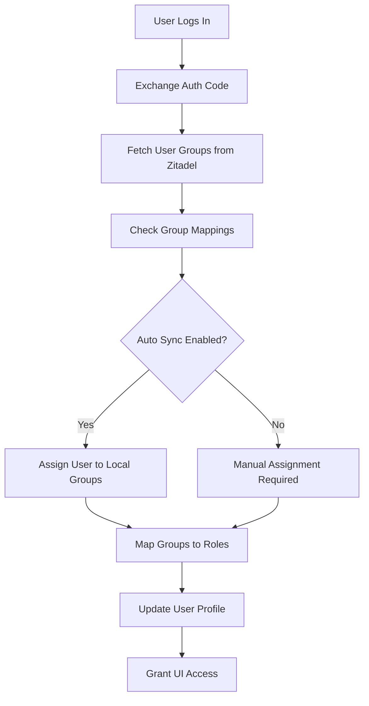

## Overview

Nexus Access Vault synchronizes groups and roles from Zitadel to control user access to features and resources. This guide explains how group mapping works and how to configure it.

## Group Synchronization Architecture



## Database Schema

Group mapping uses three key tables:

### zitadel_group_mappings

Maps Zitadel roles to local groups:

```sql
CREATE TABLE zitadel_group_mappings (
  id UUID PRIMARY KEY DEFAULT uuid_generate_v4(),
  zitadel_config_id UUID REFERENCES zitadel_configurations(id),
  zitadel_group_id TEXT NOT NULL,  -- Role key from Zitadel
  zitadel_group_name TEXT NOT NULL,  -- Display name
  local_group_id UUID REFERENCES groups(id),
  auto_sync BOOLEAN DEFAULT true,
  created_at TIMESTAMPTZ DEFAULT NOW(),
  UNIQUE(zitadel_config_id, zitadel_group_id)
);
```

### user_zitadel_identities

Links local users to their Zitadel identity:

```sql
CREATE TABLE user_zitadel_identities (
  id UUID PRIMARY KEY DEFAULT uuid_generate_v4(),
  user_id UUID REFERENCES auth.users(id),
  zitadel_config_id UUID REFERENCES zitadel_configurations(id),
  zitadel_user_id TEXT NOT NULL,  -- Zitadel's sub claim
  zitadel_groups TEXT[] DEFAULT '{}',  -- User's groups at last sync
  last_synced_at TIMESTAMPTZ DEFAULT NOW(),
  UNIQUE(user_id, zitadel_config_id)
);
```

### user_groups

Tracks user membership in local groups:

```sql
CREATE TABLE user_groups (
  id UUID PRIMARY KEY DEFAULT uuid_generate_v4(),
  user_id UUID REFERENCES auth.users(id),
  group_id UUID REFERENCES groups(id),
  created_at TIMESTAMPTZ DEFAULT NOW(),
  UNIQUE(user_id, group_id)
);
```

## Automatic Group Sync

### Fetching Groups from Zitadel

The edge function retrieves user groups during login (`supabase/functions/zitadel-api/index.ts:376-412`):

```typescript
async function getUserGroups(
  issuerUrl: string, 
  apiToken: string, 
  userId: string
): Promise<string[]> {
  const response = await fetch(
    `${issuerUrl}/management/v1/users/${userId}/grants/_search`,
    {
      method: 'POST',
      headers: {
        'Authorization': `Bearer ${apiToken}`,
        'Content-Type': 'application/json',
      },
      body: JSON.stringify({
        query: {
          limit: 100,
        },
      }),
    }
  )

  if (!response.ok) {
    console.error('User grants fetch failed:', response.status)
    return []
  }

  const data = await response.json()
  const roles: string[] = []
  
  data.result?.forEach((grant: UserGrant) => {
    grant.roles?.forEach((role: string) => {
      if (!roles.includes(role)) {
        roles.push(role)
      }
    })
  })

  return roles
}
```

### Syncing Groups on Login

When a user authenticates, their Zitadel groups are automatically synced (`supabase/functions/zitadel-api/index.ts:978-999`):

```typescript
// Map Zitadel groups to local groups if auto-sync is enabled
if (config.sync_groups && groups.length > 0) {
  const { data: mappings } = await supabaseClient
    .from('zitadel_group_mappings')
    .select('local_group_id, zitadel_group_id')
    .eq('zitadel_config_id', configId)
    .in('zitadel_group_id', groups)
    .not('local_group_id', 'is', null)
  
  if (mappings && mappings.length > 0) {
    const groupMemberships = mappings.map(m => ({
      user_id: userId,
      group_id: m.local_group_id,
    }))
    
    for (const membership of groupMemberships) {
      await supabaseClient
        .from('user_groups')
        .upsert(membership, { onConflict: 'user_id,group_id' })
    }
  }
}
```

## Role Mapping

Zitadel roles are mapped to local roles to determine UI access and permissions.

### Built-in Role Mappings

From `supabase/functions/zitadel-api/index.ts:932-945`:

```typescript
// Define mapping: Zitadel role key → local role
const roleMap: Record<string, string> = {
  'global_admin': 'global_admin',
  'admin': 'global_admin',
  'administrator': 'global_admin',
  'org_admin': 'org_admin',
  'org_manager': 'org_admin',
  'support': 'support',
  'helpdesk': 'support',
  'user': 'user',
  'member': 'user',
  'viewer': 'user',
}
```

### Role Priority

When a user has multiple roles, the highest priority role is assigned:

```typescript
const rolePriority = ['global_admin', 'org_admin', 'support', 'user']
let bestLocalRole = 'user'

for (const zRole of roles) {
  const mapped = roleMap[zRole.toLowerCase()]
  if (mapped) {
    const currentIdx = rolePriority.indexOf(bestLocalRole)
    const mappedIdx = rolePriority.indexOf(mapped)
    if (mappedIdx < currentIdx) {
      bestLocalRole = mapped
    }
  }
}

// Update profile role
await supabaseClient
  .from('profiles')
  .update({ role: bestLocalRole })
  .eq('id', userId)
```

## Group Sync API

### Sync Groups from Zitadel

Manually trigger group synchronization:

```typescript
const response = await fetch(
  `${SUPABASE_URL}/functions/v1/zitadel-api?action=sync-groups`,
  {
    method: 'POST',
    headers: {
      'Content-Type': 'application/json',
      'apikey': SUPABASE_ANON_KEY,
    },
    body: JSON.stringify({
      configId: '<zitadel-config-id>',
      projectId: '<optional-project-id>'
    })
  }
);

const result = await response.json();
```

**Response:**

```json
{
  "zitadelGroups": [
    {
      "id": "admin",
      "name": "admin",
      "displayName": "Administrator"
    },
    {
      "id": "support",
      "name": "support",
      "displayName": "Support Team"
    }
  ],
  "mappings": [
    {
      "id": "...",
      "zitadel_group_id": "admin",
      "zitadel_group_name": "Administrator",
      "local_group_id": "...",
      "auto_sync": true
    }
  ],
  "newGroupsAdded": 2,
  "rolesSource": "project_roles"
}
```

### Implementation Details

From `supabase/functions/zitadel-api/index.ts:558-634`:

```typescript
case 'sync-groups': {
  if (!config.api_token) {
    throw new Error('API token not configured')
  }

  const projectId = config.project_id || body.projectId
  
  // Fetch roles from Zitadel
  let zitadelGroups = await listGroups(
    config.issuer_url, 
    config.api_token, 
    projectId
  )
  let rolesSource = 'project_roles'
  
  // If no roles found, extract from user grants
  if (zitadelGroups.length === 0) {
    const users = await listProjectUserGrants(
      config.issuer_url, 
      config.api_token, 
      projectId
    )
    const uniqueRoles = new Set<string>()
    
    users.forEach(user => {
      if (user.groups && Array.isArray(user.groups)) {
        user.groups.forEach((role: string) => uniqueRoles.add(role))
      }
    })
    
    zitadelGroups = Array.from(uniqueRoles).map(role => ({
      id: role,
      name: role,
      displayName: role,
    }))
    rolesSource = 'user_grants'
  }

  // Sync with local database
  const existingMappings = await supabaseClient
    .from('zitadel_group_mappings')
    .select('zitadel_group_id')
    .eq('zitadel_config_id', configId)

  const existingIds = new Set(
    existingMappings.data?.map(m => m.zitadel_group_id) || []
  )
  
  const newMappings = zitadelGroups
    .filter(g => !existingIds.has(g.id))
    .map(g => ({
      zitadel_config_id: configId,
      zitadel_group_id: g.id,
      zitadel_group_name: g.displayName || g.name,
      auto_sync: true,
    }))

  if (newMappings.length > 0) {
    await supabaseClient
      .from('zitadel_group_mappings')
      .insert(newMappings)
  }
  
  return { zitadelGroups, mappings, newGroupsAdded: newMappings.length }
}
```

## Manual Group Mapping

To map a Zitadel group to a local group:

```sql
-- First, create local group if it doesn't exist
INSERT INTO groups (name, description, organization_id)
VALUES ('Administrators', 'System administrators', '<org-id>')
RETURNING id;

-- Then create the mapping
INSERT INTO zitadel_group_mappings (
  zitadel_config_id,
  zitadel_group_id,
  zitadel_group_name,
  local_group_id,
  auto_sync
) VALUES (
  '<config-id>',
  'admin',  -- Zitadel role key
  'Administrator',  -- Display name
  '<local-group-id>',
  true  -- Enable auto-sync
);
```

## UI Access Control

Group membership determines which UI elements users can access.

### Checking Groups in React

From `src/components/AuthProvider.tsx:146-148`:

```typescript
const hasZitadelGroup = (group: string) => {
  return zitadelIdentity?.zitadel_groups?.includes(group) || false;
};
```

### Sidebar Access Control

From `src/components/AppSidebar.tsx:62-64`:

```typescript
// Check Zitadel groups for additional permissions
const hasAdminGroup = hasZitadelGroup('admin') || 
                      hasZitadelGroup('administrator') || 
                      hasZitadelGroup('org_admin');
const hasSupportGroup = hasZitadelGroup('support') || 
                        hasZitadelGroup('helpdesk');
```

### Conditional Rendering

From `src/components/AppSidebar.tsx:77-81`:

```typescript
// Support or users with support/admin Zitadel group can access marketplace
if (isSupport || isAdmin || hasSupportGroup || hasAdminGroup) {
  baseItems.splice(2, 0, { title: "App Marketplace", url: "/app-marketplace" });
  baseItems.push({ title: "Downloads", url: "/downloads" });
  baseItems.push({ title: "Audit Log", url: "/audit" });
}
```

## Group Sync Strategies

### Real-time Sync (Current)

Groups are synced when users log in:

**Pros:**
- Always up-to-date on login
- No background jobs needed
- Simple implementation

**Cons:**
- Groups only update on login
- No sync for already logged-in users

### Periodic Sync (Future Enhancement)

Background job syncs groups every N hours:

```typescript
// Pseudo-code for future implementation
setInterval(async () => {
  const activeUsers = await getActiveUsers();
  
  for (const user of activeUsers) {
    const zitadelIdentity = await getZitadelIdentity(user.id);
    const currentGroups = await getUserGroups(
      issuerUrl, 
      apiToken, 
      zitadelIdentity.zitadel_user_id
    );
    
    await updateUserGroups(user.id, currentGroups);
  }
}, 3600000); // Every hour
```

## Best Practices

<Warning>
  **Group Naming Convention**: Use lowercase, hyphenated names for Zitadel role keys (e.g., `org-admin`, `support-team`). Display names can use any format.
</Warning>

### Keep Zitadel as Source of Truth

- Always sync groups from Zitadel → Local, never the reverse
- Don't manually add users to groups that are auto-synced
- Use Zitadel's group management UI exclusively

### Use Descriptive Display Names

```sql
INSERT INTO zitadel_group_mappings (
  zitadel_group_id,
  zitadel_group_name,
  ...
) VALUES (
  'org_admin',  -- Role key (used in code)
  'Organization Administrator',  -- Display name (shown in UI)
  ...
);
```

### Enable Auto-Sync by Default

Unless you have a specific reason not to, enable auto-sync:

```sql
auto_sync = true  -- Recommended for most use cases
```

### Test Group Access

After mapping groups, test with a user account:

1. Assign the role in Zitadel
2. Have the user log out and log back in
3. Verify the correct groups appear in `user_zitadel_identities`
4. Check that UI elements appear/disappear correctly

## Troubleshooting

### Groups Not Appearing

**Check Service Account Permissions:**

```bash
# Test API token
curl -X POST \
  "https://manager.kappa4.com/management/v1/users/${USER_ID}/grants/_search" \
  -H "Authorization: Bearer ${API_TOKEN}" \
  -H "Content-Type: application/json" \
  -d '{"query": {"limit": 100}}'
```

If you get a 403/404, the service account needs `org.grant.read` permission.

### Groups Not Syncing

**Check Configuration:**

```sql
SELECT sync_groups, api_token IS NOT NULL as has_token
FROM zitadel_configurations
WHERE id = '<config-id>';
```

Both should be `true`.

### User Has Wrong Role

**Check Role Mapping:**

```sql
SELECT 
  uzi.zitadel_groups,
  p.role as current_role
FROM user_zitadel_identities uzi
JOIN profiles p ON p.id = uzi.user_id
WHERE uzi.user_id = '<user-id>';
```

Verify the Zitadel groups match expected roles in the `roleMap`.

## Next Steps

- [Implement role-based access control](/authentication/role-based-access)
- [Return to OIDC configuration](/authentication/oidc-configuration)
- [Return to Zitadel setup](/authentication/zitadel-setup)