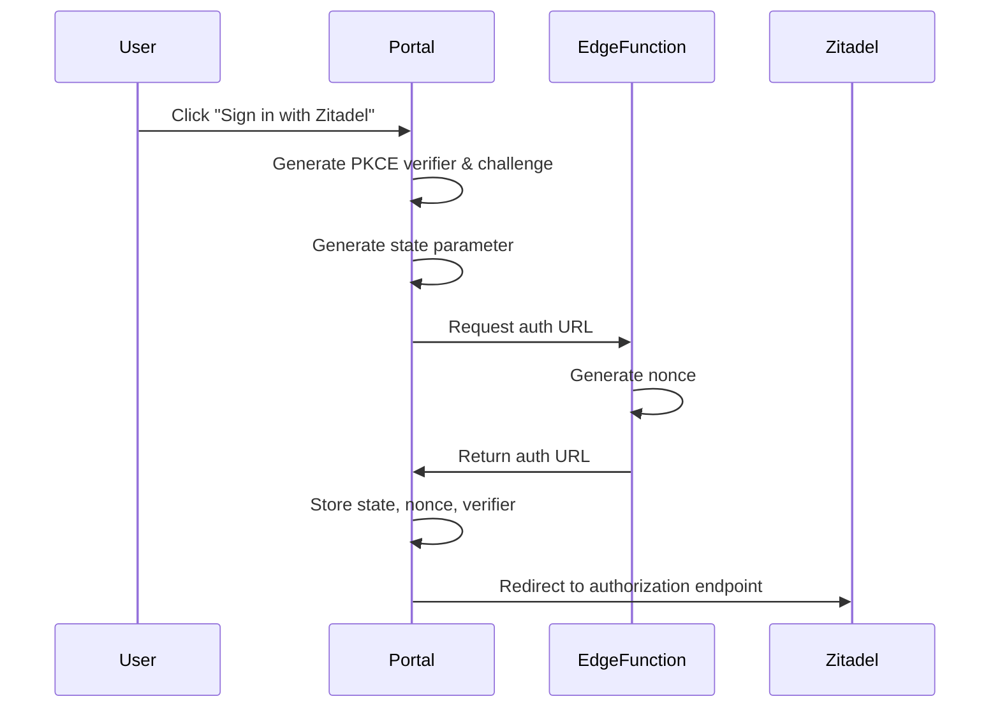
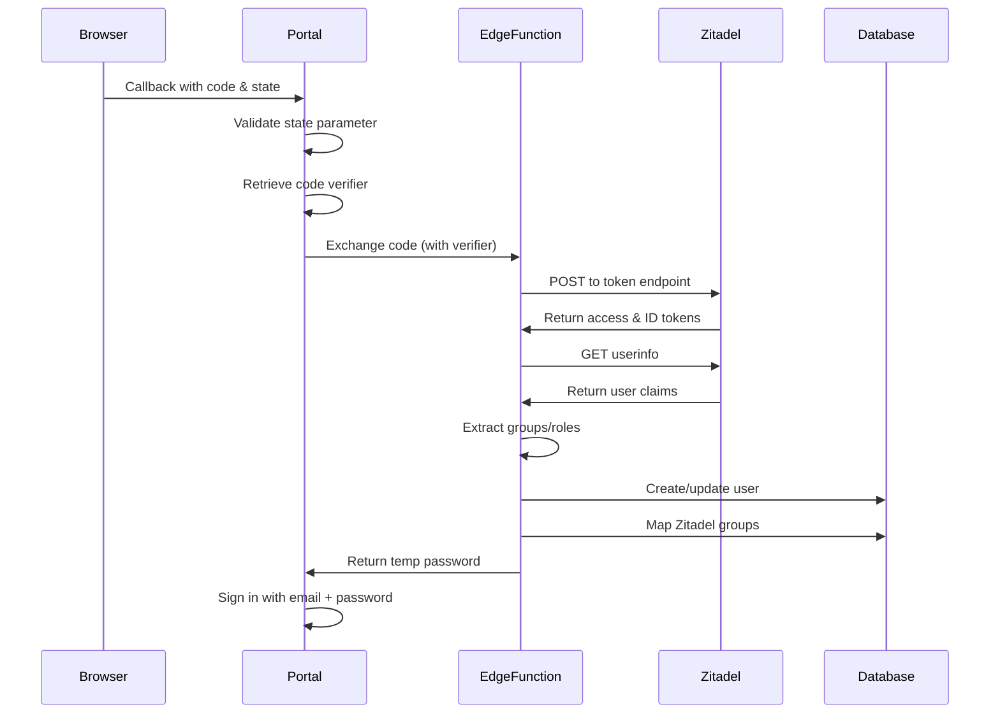

## OIDC Discovery

Nexus Access Vault uses OIDC Discovery to automatically configure authentication endpoints. The discovery document is fetched from:

```
https://manager.kappa4.com/.well-known/openid-configuration
```

### Discovery Implementation

From `supabase/functions/zitadel-api/index.ts:40-47`:

```typescript
async function getOIDCDiscovery(issuerUrl: string) {
  const response = await fetch(`${issuerUrl}/.well-known/openid-configuration`)
  if (!response.ok) {
    throw new Error(`Failed to fetch OIDC discovery: ${response.status}`)
  }
  return await response.json()
}
```

This provides the following endpoints:
- `authorization_endpoint` - Where users are redirected to authenticate
- `token_endpoint` - Where authorization codes are exchanged for tokens
- `userinfo_endpoint` - Where user information is retrieved
- `jwks_uri` - Public keys for token verification

## Complete Authentication Flow

The authentication process follows the OAuth 2.0 Authorization Code flow with PKCE:

### Phase 1: Initiate SSO



**Code Implementation** (`src/hooks/useZitadelSSO.ts:52-98`):

```typescript
const initiateSSO = async (configId: string) => {
  setLoading(true);
  try {
    // Generate PKCE parameters
    const { codeVerifier, codeChallenge } = await generatePKCE();
    
    // Generate random state
    const stateArray = new Uint8Array(32);
    crypto.getRandomValues(stateArray);
    const state = btoa(String.fromCharCode(...stateArray))
      .replace(/\+/g, '-')
      .replace(/\//g, '_')
      .replace(/=/g, '');
    
    // Get auth URL from edge function
    const response = await fetch(
      `${import.meta.env.VITE_SUPABASE_URL}/functions/v1/zitadel-api?action=get-auth-url`,
      {
        method: 'POST',
        headers: {
          'Content-Type': 'application/json',
          'apikey': import.meta.env.VITE_SUPABASE_PUBLISHABLE_KEY,
        },
        body: JSON.stringify({ 
          configId,
          state,
          codeVerifier: codeChallenge, // Send challenge to server
        }),
      }
    );

    const result = await response.json();

    // Store state and code verifier for callback verification
    localStorage.setItem('zitadel_state', state);
    localStorage.setItem('zitadel_nonce', result.nonce || state);
    localStorage.setItem('zitadel_config_id', configId);
    localStorage.setItem('zitadel_code_verifier', codeVerifier);

    // Redirect to Zitadel
    window.location.href = result.authUrl;
  } catch (error) {
    console.error('SSO initiation error:', error);
  }
};
```

### Phase 2: User Authentication

At this point, the user is at Zitadel's login page. They:
1. Enter their credentials
2. Complete MFA if required
3. Grant consent (if first time)

Zitadel then redirects back to your callback URI with:
- `code` - Authorization code
- `state` - The same state parameter you sent

### Phase 3: Token Exchange



**Token Exchange Implementation** (`supabase/functions/zitadel-api/index.ts:49-87`):

```typescript
async function exchangeCodeForTokens(
  config: ZitadelConfig,
  code: string,
  codeVerifier?: string
) {
  const discovery = await getOIDCDiscovery(config.issuer_url)
  
  const params = new URLSearchParams({
    grant_type: 'authorization_code',
    client_id: config.client_id,
    code,
    redirect_uri: config.redirect_uri,
  })

  if (config.client_secret) {
    params.append('client_secret', config.client_secret)
  }

  if (codeVerifier) {
    params.append('code_verifier', codeVerifier)
  }

  const response = await fetch(discovery.token_endpoint, {
    method: 'POST',
    headers: {
      'Content-Type': 'application/x-www-form-urlencoded',
    },
    body: params,
  })

  if (!response.ok) {
    const error = await response.text()
    console.error('Token exchange error:', error)
    throw new Error(`Token exchange failed: ${response.status}`)
  }

  return await response.json()
}
```

### Phase 4: User Provisioning

The edge function handles user provisioning automatically (`supabase/functions/zitadel-api/index.ts:809-928`):

```typescript
case 'sso-callback': {
  // Exchange code for tokens
  const tokens = await exchangeCodeForTokens(config, code, codeVerifier)
  const userInfo = await getUserInfo(config.issuer_url, tokens.access_token)
  
  // Get user groups/roles
  let groups: string[] = []
  if (config.api_token && userInfo.sub) {
    groups = await getUserGroups(config.issuer_url, config.api_token, userInfo.sub)
  }
  
  // Extract claims
  const email = userInfo.email || userInfo.preferred_username
  const orgId = userInfo['urn:zitadel:iam:org:id'] || config.organization_id
  
  // Check if user exists
  let existingUser: { id: string } | null = null
  
  // Method 1: Check by Zitadel identity link
  const { data: zitadelLink } = await supabaseClient
    .from('user_zitadel_identities')
    .select('user_id')
    .eq('zitadel_user_id', userInfo.sub)
    .eq('zitadel_config_id', configId)
    .single()
  
  if (zitadelLink) {
    existingUser = { id: zitadelLink.user_id }
  } else {
    // Method 2: Check by email
    const { data: authUsers } = await supabaseClient.auth.admin.listUsers()
    const matchedUser = authUsers?.users?.find(u => u.email === email)
    if (matchedUser) {
      existingUser = { id: matchedUser.id }
    }
  }
  
  // Create or update user...
}
```

## Configuration Schema

The `zitadel_configurations` table stores OIDC settings:

```sql
CREATE TABLE zitadel_configurations (
  id UUID PRIMARY KEY DEFAULT uuid_generate_v4(),
  organization_id UUID REFERENCES organizations(id),
  name TEXT NOT NULL,
  issuer_url TEXT NOT NULL,
  client_id TEXT NOT NULL,
  client_secret TEXT,  -- Optional for confidential clients
  redirect_uri TEXT NOT NULL,
  scopes TEXT[] DEFAULT ARRAY['openid', 'profile', 'email'],
  api_token TEXT,  -- Service account PAT
  project_id TEXT,  -- Zitadel project ID
  sync_groups BOOLEAN DEFAULT true,
  is_active BOOLEAN DEFAULT true,
  created_at TIMESTAMPTZ DEFAULT NOW(),
  updated_at TIMESTAMPTZ DEFAULT NOW()
);
```

### Configuration Fields

| Field | Type | Required | Description |
|-------|------|----------|-------------|
| `issuer_url` | TEXT | Yes | Zitadel instance URL (e.g., `https://manager.kappa4.com`) |
| `client_id` | TEXT | Yes | Application client ID from Zitadel |
| `client_secret` | TEXT | No | Only needed for confidential clients (not used with PKCE) |
| `redirect_uri` | TEXT | Yes | Callback URL where Zitadel sends auth code |
| `scopes` | TEXT[] | Yes | OIDC scopes to request |
| `api_token` | TEXT | No | Service account PAT for group sync |
| `project_id` | TEXT | No | Zitadel project ID for role filtering |
| `sync_groups` | BOOLEAN | No | Enable automatic group synchronization |

## Scope Configuration

### Standard OIDC Scopes

```typescript
const scopes = [
  'openid',    // Required - enables OIDC
  'profile',   // User's name and profile info
  'email',     // User's email address
];
```

### Zitadel-Specific Scopes

```typescript
const zitadelScopes = [
  'urn:zitadel:iam:org:project:id:zitadel:aud',  // Organization and role claims
];
```

This scope adds the following claims to the ID token:
- `urn:zitadel:iam:org:id` - Organization ID
- `urn:zitadel:iam:org:name` - Organization name
- `urn:zitadel:iam:org:domain` - Organization domain
- Project role assignments

## Claims Mapping

After authentication, claims are extracted from the userinfo response:

```typescript
// Standard claims
const email = userInfo.email || userInfo.preferred_username
const name = userInfo.name || userInfo.preferred_username
const userId = userInfo.sub  // Zitadel user ID

// Zitadel-specific claims
const orgId = userInfo['urn:zitadel:iam:org:id']
const orgName = userInfo['urn:zitadel:iam:org:domain'] || 
                userInfo['urn:zitadel:iam:org:name']
```

## Security Best Practices

<Warning>
  **Token Storage**: Never store access tokens or refresh tokens in localStorage or sessionStorage. Nexus Access Vault only stores them temporarily during the authentication flow, then relies on Supabase's secure session management.
</Warning>

### State Parameter Validation

Always validate the state parameter to prevent CSRF attacks:

```typescript
// Before initiating flow
localStorage.setItem('zitadel_state', state);

// In callback handler
const storedState = localStorage.getItem('zitadel_state');
if (storedState !== returnedState) {
  throw new Error('State mismatch - possible CSRF attack');
}
localStorage.removeItem('zitadel_state');
```

### Code Verifier Security

The code verifier must:
- Be cryptographically random (32 bytes minimum)
- Never be sent to the authorization endpoint
- Only be sent during token exchange
- Be single-use (deleted after exchange)

### Nonce Validation

The nonce prevents replay attacks on ID tokens:

```typescript
// Server generates nonce (index.ts:795-799)
const nonceArray = new Uint8Array(32)
crypto.getRandomValues(nonceArray)
const nonce = Array.from(nonceArray)
  .map(b => b.toString(16).padStart(2, '0'))
  .join('')
```

## Error Handling

### Common OIDC Errors

| Error Code | Meaning | Solution |
|------------|---------|----------|
| `invalid_request` | Malformed request | Check all required parameters |
| `invalid_client` | Client ID not found | Verify client_id matches Zitadel |
| `invalid_grant` | Code expired/used | Retry authentication |
| `unauthorized_client` | Wrong auth method | Ensure PKCE is enabled in Zitadel |
| `unsupported_grant_type` | Wrong grant type | Should be `authorization_code` |

### Error Response Example

```typescript
try {
  const tokens = await exchangeCodeForTokens(config, code, codeVerifier)
} catch (error) {
  // Error responses from token endpoint
  {
    "error": "invalid_grant",
    "error_description": "The provided authorization grant is invalid, expired, or revoked"
  }
}
```

## Testing Configuration

Test your OIDC configuration with the built-in test endpoint:

```bash
curl -X POST \
  "${SUPABASE_URL}/functions/v1/zitadel-api?action=test-connection" \
  -H "Content-Type: application/json" \
  -H "apikey: ${SUPABASE_ANON_KEY}" \
  -d '{
    "issuerUrl": "https://manager.kappa4.com",
    "apiToken": "<service-account-token>"
  }'
```

**Expected Response:**

```json
{
  "success": true,
  "apiConnected": true,
  "groupCount": 5,
  "message": "Connection successful"
}
```

## Next Steps

- [Set up group mapping](/authentication/group-mapping)
- [Implement role-based access control](/authentication/role-based-access)
- [Return to Zitadel setup](/authentication/zitadel-setup)