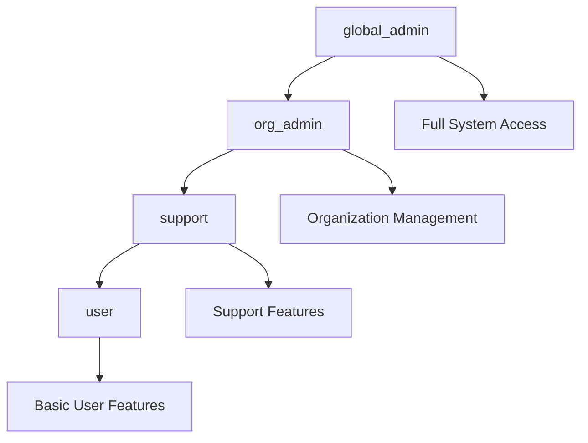

## Overview

Nexus Access Vault implements a hybrid RBAC system that combines:
- **Local Roles** stored in the `profiles` table
- **Zitadel Groups** synchronized from your identity provider
- **Permission Checks** at both UI and API levels

This approach provides flexibility while maintaining Zitadel as the source of truth for identity and group membership.

## Role Hierarchy



### Role Definitions

| Role | Level | Permissions |
|------|-------|-------------|
| `global_admin` | System | All features, all organizations, policy management |
| `org_admin` | Organization | User management, group management, resources within org |
| `support` | Organization | Extended support features, marketplace, audit logs |
| `user` | Basic | Own applications, devices, sessions |

## Role Assignment

Roles are assigned automatically based on Zitadel group membership during login.

### Automatic Role Mapping

From `supabase/functions/zitadel-api/index.ts:932-976`:

```typescript
// Map Zitadel roles to user_roles table for sidebar/view control
if (roles.length > 0) {
  // Define mapping: Zitadel role key → local role
  const roleMap: Record<string, string> = {
    'global_admin': 'global_admin',
    'admin': 'global_admin',
    'administrator': 'global_admin',
    'org_admin': 'org_admin',
    'org_manager': 'org_admin',
    'support': 'support',
    'helpdesk': 'support',
    'user': 'user',
    'member': 'user',
    'viewer': 'user',
  }
  
  // Find the highest-priority local role from Zitadel roles
  const rolePriority = ['global_admin', 'org_admin', 'support', 'user']
  let bestLocalRole = 'user'
  
  for (const zRole of roles) {
    const mapped = roleMap[zRole.toLowerCase()]
    if (mapped) {
      const currentIdx = rolePriority.indexOf(bestLocalRole)
      const mappedIdx = rolePriority.indexOf(mapped)
      if (mappedIdx < currentIdx) {
        bestLocalRole = mapped
      }
    }
  }
  
  // Update profile role
  await supabaseClient
    .from('profiles')
    .update({ role: bestLocalRole })
    .eq('id', userId)
  
  // Upsert into user_roles table
  await supabaseClient
    .from('user_roles')
    .upsert(
      { user_id: userId, role: bestLocalRole },
      { onConflict: 'user_id,role' }
    )
}
```

### Custom Role Mappings

You can extend the `roleMap` to include custom Zitadel roles:

```typescript
const roleMap: Record<string, string> = {
  // ... existing mappings ...
  'custom_analyst': 'support',
  'custom_manager': 'org_admin',
  'custom_superuser': 'global_admin',
}
```

## Authentication Context

The `AuthProvider` component makes role information available throughout the app.

### AuthProvider Implementation

From `src/components/AuthProvider.tsx:21-31`:

```typescript
interface AuthContextType {
  user: User | null;
  session: Session | null;
  profile: UserProfile | null;
  roles: string[];  // From user_roles table
  zitadelIdentity: ZitadelIdentity | null;  // Includes groups
  loading: boolean;
  signOut: () => Promise<void>;
  hasRole: (role: string) => boolean;
  hasZitadelGroup: (group: string) => boolean;  // Check Zitadel groups
}
```

### Using Auth Context

```typescript
import { useAuth } from '@/components/AuthProvider';

function MyComponent() {
  const { profile, hasRole, hasZitadelGroup } = useAuth();
  
  // Check local role
  if (hasRole('global_admin')) {
    // Render admin features
  }
  
  // Check Zitadel group
  if (hasZitadelGroup('support')) {
    // Render support features
  }
  
  // Check profile role directly
  if (profile?.role === 'org_admin') {
    // Render org admin features
  }
}
```

## UI Access Control

### Sidebar Navigation

The sidebar adapts based on user roles and groups.

From `src/components/AppSidebar.tsx:54-89`:

```typescript
const isAdmin = profile?.role === 'org_admin' || profile?.role === 'global_admin';
const isGlobalAdmin = profile?.role === 'global_admin';
const isSupport = profile?.role === 'support';

// Check Zitadel groups for additional permissions
const hasAdminGroup = hasZitadelGroup('admin') || 
                      hasZitadelGroup('administrator') || 
                      hasZitadelGroup('org_admin');
const hasSupportGroup = hasZitadelGroup('support') || 
                        hasZitadelGroup('helpdesk');

// Build navigation items based on role
const getClientItems = () => {
  const baseItems = [
    { title: "Dashboard", url: "/dashboard", icon: LayoutDashboard },
    { title: "My Applications", url: "/my-applications", icon: AppWindow },
    { title: "My Devices", url: "/my-devices", icon: Laptop2 },
    { title: "Sessions", url: "/sessions", icon: Activity },
  ];

  // Support or users with support/admin Zitadel group get additional items
  if (isSupport || isAdmin || hasSupportGroup || hasAdminGroup) {
    baseItems.splice(2, 0, { 
      title: "App Marketplace", 
      url: "/app-marketplace", 
      icon: Store 
    });
    baseItems.push({ title: "Downloads", url: "/downloads", icon: Download });
    baseItems.push({ title: "Audit Log", url: "/audit", icon: ScrollText });
  }

  return baseItems;
};

// Show admin panel to support and admins (including Zitadel groups)
const showAdminPanel = isSupport || isAdmin || hasSupportGroup || hasAdminGroup;
```

### Admin Panel Access

From `src/components/AppSidebar.tsx:91-109`:

```typescript
const adminItems = (isSupport || hasSupportGroup) ? [
  // Support users see limited admin features
  { title: "Admin Panel", url: "/admin-panel", icon: Users },
  { title: "Org Tree", url: "/org-tree", icon: GitBranch },
  { title: "Users", url: "/users", icon: Users },
  { title: "Groups", url: "/groups", icon: Layers },
  { title: "Resources", url: "/resources", icon: Server },
] : [
  // Full admins see all features
  { title: "Admin Panel", url: "/admin-panel", icon: Users },
  { title: "Org Tree", url: "/org-tree", icon: GitBranch },
  { title: "Roles & Permisos", url: "/roles-permissions", icon: Lock },
  { title: "Users", url: "/users", icon: Users },
  { title: "Groups", url: "/groups", icon: Layers },
  { title: "Resources", url: "/resources", icon: Server },
  { title: "Cloud Providers", url: "/cloud-providers", icon: Cloud },
  { title: "Hypervisors", url: "/hypervisors", icon: Network },
  { title: "Headscale", url: "/headscale", icon: Workflow },
  { title: "Zitadel OIDC", url: "/zitadel", icon: Key },
  { title: "Usuarios Zitadel", url: "/zitadel-users", icon: UserCheck },
];
```

### Conditional Rendering Pattern

```typescript
import { useAuth } from '@/components/AuthProvider';

function FeaturePage() {
  const { profile, hasZitadelGroup } = useAuth();
  
  // Combine local role and Zitadel group checks
  const canAccessFeature = 
    profile?.role === 'org_admin' || 
    profile?.role === 'global_admin' ||
    hasZitadelGroup('admin') ||
    hasZitadelGroup('support');
  
  if (!canAccessFeature) {
    return <AccessDenied />;
  }
  
  return (
    <div>
      {/* Feature content */}
      
      {/* Global admin only */}
      {profile?.role === 'global_admin' && (
        <PolicyManagement />
      )}
      
      {/* Admin or support */}
      {(profile?.role === 'org_admin' || hasZitadelGroup('support')) && (
        <UserManagement />
      )}
    </div>
  );
}
```

## API-Level Authorization

While UI controls improve UX, **never rely solely on frontend checks**. Always validate permissions on the backend.

### Row Level Security (RLS)

Supabase RLS policies enforce permissions at the database level:

```sql
-- Example: Users can only see their own applications
CREATE POLICY "Users can view own applications"
ON applications
FOR SELECT
USING (
  user_id = auth.uid()
  OR
  -- Admins can see all
  EXISTS (
    SELECT 1 FROM profiles
    WHERE id = auth.uid()
    AND role IN ('global_admin', 'org_admin')
  )
);

-- Example: Only admins can manage users
CREATE POLICY "Admins can manage users"
ON profiles
FOR ALL
USING (
  EXISTS (
    SELECT 1 FROM profiles
    WHERE id = auth.uid()
    AND role IN ('global_admin', 'org_admin')
  )
);
```

### Edge Function Authorization

Validate roles in edge functions:

```typescript
import { createClient } from '@supabase/supabase-js';

serve(async (req) => {
  const supabaseClient = createClient(
    Deno.env.get('SUPABASE_URL') ?? '',
    Deno.env.get('SUPABASE_SERVICE_ROLE_KEY') ?? ''
  );
  
  // Get current user
  const authHeader = req.headers.get('Authorization');
  const token = authHeader?.replace('Bearer ', '');
  const { data: { user } } = await supabaseClient.auth.getUser(token);
  
  if (!user) {
    return new Response('Unauthorized', { status: 401 });
  }
  
  // Check role
  const { data: profile } = await supabaseClient
    .from('profiles')
    .select('role')
    .eq('id', user.id)
    .single();
  
  if (!['global_admin', 'org_admin'].includes(profile?.role)) {
    return new Response('Forbidden', { status: 403 });
  }
  
  // Proceed with admin operation
  // ...
});
```

### Combining Role and Group Checks

```typescript
// Check both profile role and Zitadel groups
const { data: profile } = await supabaseClient
  .from('profiles')
  .select('role')
  .eq('id', user.id)
  .single();

const { data: zitadelIdentity } = await supabaseClient
  .from('user_zitadel_identities')
  .select('zitadel_groups')
  .eq('user_id', user.id)
  .single();

const isAdmin = 
  ['global_admin', 'org_admin'].includes(profile?.role) ||
  zitadelIdentity?.zitadel_groups?.some(g => 
    ['admin', 'administrator', 'org_admin'].includes(g)
  );

if (!isAdmin) {
  return new Response('Forbidden', { status: 403 });
}
```

## Permission Granularity

### Feature-Level Permissions

Control access to entire features:

```typescript
const FEATURE_PERMISSIONS = {
  marketplace: ['global_admin', 'org_admin', 'support'],
  audit_logs: ['global_admin', 'org_admin', 'support'],
  user_management: ['global_admin', 'org_admin'],
  organization_management: ['global_admin'],
  policy_management: ['global_admin'],
};

function hasFeatureAccess(feature: string, userRole: string): boolean {
  return FEATURE_PERMISSIONS[feature]?.includes(userRole) ?? false;
}
```

### Action-Level Permissions

Control specific actions within features:

```typescript
const ACTION_PERMISSIONS = {
  'users.create': ['global_admin', 'org_admin'],
  'users.read': ['global_admin', 'org_admin', 'support'],
  'users.update': ['global_admin', 'org_admin'],
  'users.delete': ['global_admin'],
  'applications.read': ['global_admin', 'org_admin', 'support', 'user'],
  'applications.create': ['global_admin', 'org_admin', 'user'],
};

function canPerformAction(action: string, userRole: string): boolean {
  return ACTION_PERMISSIONS[action]?.includes(userRole) ?? false;
}
```

### Resource-Level Permissions

Control access to specific resources:

```typescript
function canAccessResource(
  resourceOrgId: string,
  userOrgId: string,
  userRole: string
): boolean {
  // Global admins can access all resources
  if (userRole === 'global_admin') {
    return true;
  }
  
  // Org admins and users can only access resources in their org
  return resourceOrgId === userOrgId;
}
```

## Best Practices

<Warning>
  **Defense in Depth**: Always implement authorization at multiple levels:
  1. UI (hide/disable features)
  2. API routes (validate before processing)
  3. Database (RLS policies)
  4. Edge functions (validate user context)
</Warning>

### 1. Use Declarative Checks

```typescript
// Good: Declarative and reusable
const canManageUsers = hasRole('org_admin') || hasRole('global_admin');

// Bad: Imperative and repetitive
if (profile?.role === 'org_admin' || profile?.role === 'global_admin') {
  // ...
}
```

### 2. Centralize Permission Logic

```typescript
// permissions.ts
export const permissions = {
  canViewAuditLogs: (role: string) => 
    ['global_admin', 'org_admin', 'support'].includes(role),
    
  canManageUsers: (role: string) => 
    ['global_admin', 'org_admin'].includes(role),
    
  canManagePolicies: (role: string) => 
    role === 'global_admin',
};

// Usage
import { permissions } from '@/lib/permissions';

if (permissions.canViewAuditLogs(profile.role)) {
  // Show audit logs
}
```

### 3. Log Permission Checks

```typescript
function checkPermission(
  action: string, 
  userId: string, 
  role: string
): boolean {
  const hasPermission = ACTION_PERMISSIONS[action]?.includes(role) ?? false;
  
  // Log for audit trail
  console.log({
    timestamp: new Date().toISOString(),
    userId,
    role,
    action,
    granted: hasPermission,
  });
  
  return hasPermission;
}
```

### 4. Fail Securely

```typescript
// Good: Defaults to deny
const hasAccess = ALLOWED_ROLES.includes(userRole) ?? false;

// Bad: Defaults to allow
const hasAccess = !BLOCKED_ROLES.includes(userRole);
```

## Testing RBAC

### Unit Tests

```typescript
import { permissions } from '@/lib/permissions';

describe('permissions', () => {
  it('should allow global admin to manage policies', () => {
    expect(permissions.canManagePolicies('global_admin')).toBe(true);
  });
  
  it('should deny org admin from managing policies', () => {
    expect(permissions.canManagePolicies('org_admin')).toBe(false);
  });
  
  it('should allow support to view audit logs', () => {
    expect(permissions.canViewAuditLogs('support')).toBe(true);
  });
});
```

### Integration Tests

```typescript
import { createClient } from '@supabase/supabase-js';

describe('User Management API', () => {
  it('should allow org_admin to create users', async () => {
    const supabase = createClient(SUPABASE_URL, ORG_ADMIN_KEY);
    
    const { data, error } = await supabase
      .from('profiles')
      .insert({ full_name: 'Test User', role: 'user' });
    
    expect(error).toBeNull();
    expect(data).toBeDefined();
  });
  
  it('should deny regular user from creating users', async () => {
    const supabase = createClient(SUPABASE_URL, USER_KEY);
    
    const { error } = await supabase
      .from('profiles')
      .insert({ full_name: 'Test User', role: 'user' });
    
    expect(error).toBeDefined();
    expect(error.code).toBe('42501'); // PostgreSQL permission denied
  });
});
```

## Troubleshooting

### User Has Wrong Permissions

**Check their role assignment:**

```sql
SELECT 
  p.full_name,
  p.role,
  uzi.zitadel_groups
FROM profiles p
LEFT JOIN user_zitadel_identities uzi ON uzi.user_id = p.id
WHERE p.id = '<user-id>';
```

**Verify role mapping:**

```typescript
// Check if their Zitadel group is mapped correctly
const roleMap = {
  'their_zitadel_group': 'expected_local_role'
};
```

### Permission Denied Errors

**Check RLS policies:**

```sql
SELECT 
  schemaname,
  tablename,
  policyname,
  permissive,
  roles,
  cmd,
  qual
FROM pg_policies
WHERE tablename = 'your_table';
```

**Test as specific user:**

```sql
SET ROLE authenticated;
SET request.jwt.claim.sub = '<user-id>';

SELECT * FROM your_table;
-- Should respect RLS policies
```

## Next Steps

- [Review group mapping](/authentication/group-mapping)
- [Configure OIDC settings](/authentication/oidc-configuration)
- [Return to Zitadel setup](/authentication/zitadel-setup)