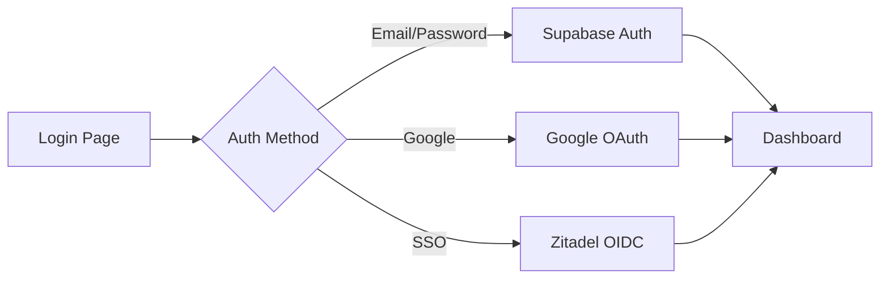

Nexus Access Vault supports multiple authentication methods to suit your organization's needs.

## Authentication Methods

Nexus Access Vault provides three authentication options:

- **Email/Password** - Traditional authentication with Supabase
- **Google OAuth** - Sign in with Google accounts
- **Corporate SSO** - Enterprise single sign-on via Zitadel

## First-Time Setup

<Steps>
  <Step title="Access the login page">
    Navigate to your Nexus Access Vault instance:

    ```bash
    http://localhost:8080
    # or your configured host
    ```

    You'll see the authentication page with the Neogenesys branding.
  </Step>

  <Step title="Create your first account">
    Click **"Don't have an account? Sign up"** to switch to registration mode.

    Fill in the registration form:

    - **Full Name** - Your complete name (minimum 2 characters)
    - **Email** - A valid email address
    - **Password** - At least 6 characters

    ```tsx
    // Validation schema
    {
      email: z.string().email('Invalid email address'),
      password: z.string().min(6, 'Password must be at least 6 characters'),
      fullName: z.string().min(2, 'Name must be at least 2 characters')
    }
    ```
  </Step>

  <Step title="Verify your email">
    After registration, check your email for a verification link from Supabase.

    <Note>
      In development mode, you may be automatically logged in without email verification.
    </Note>
  </Step>

  <Step title="Access the dashboard">
    Once authenticated, you'll be redirected to `/dashboard` where you can:

    - View your applications
    - Manage devices
    - Access resources
    - Configure settings
  </Step>
</Steps>

## Email/Password Authentication

The default authentication method uses Supabase Auth:

```typescript
// Sign up
const { error } = await supabase.auth.signUp({
  email,
  password,
  options: {
    emailRedirectTo: `${window.location.origin}/dashboard`,
    data: {
      full_name: fullName
    }
  }
});

// Sign in
const { error } = await supabase.auth.signInWithPassword({
  email,
  password
});
```

### Password Requirements

- Minimum length: 6 characters
- No maximum length
- Supports all characters including special symbols

<Tip>
  Use strong passwords with a mix of uppercase, lowercase, numbers, and special characters.
</Tip>

## Google OAuth

Sign in with your Google account for seamless authentication:

<Steps>
  <Step title="Configure Google OAuth in Supabase">
    1. Navigate to **Authentication** > **Providers** in your Supabase dashboard
    2. Enable Google provider
    3. Add your OAuth credentials from [Google Cloud Console](https://console.cloud.google.com)
  </Step>

  <Step title="Set redirect URL">
    Add your application URL to authorized redirect URIs:

    ```
    http://localhost:8080
    https://your-domain.com
    ```
  </Step>

  <Step title="Sign in with Google">
    On the login page, click **"Iniciar sesión con Google"** to authenticate.
  </Step>
</Steps>

## Corporate SSO (Zitadel)

Enterprise users can authenticate via Zitadel OIDC:

<Steps>
  <Step title="Configure Zitadel">
    Set up your Zitadel environment variables:

    ```bash
    VITE_ZITADEL_ISSUER_URL="https://manager.kappa4.com"
    VITE_ZITADEL_CLIENT_ID="your-client-id"
    VITE_ZITADEL_REDIRECT_URI="http://localhost:8080/auth/callback"
    ```
  </Step>

  <Step title="Create OIDC application in Zitadel">
    1. Log in to your Zitadel instance at `manager.kappa4.com`
    2. Create a new OIDC application
    3. Configure the redirect URI to match `VITE_ZITADEL_REDIRECT_URI`
    4. Copy the client ID
  </Step>

  <Step title="Enable SSO in Nexus Access Vault">
    The SSO button will automatically appear on the login page when Zitadel is configured:

    ```tsx
    {availableConfigs.length > 0 && (
      <Button onClick={() => initiateSSO(config.id)}>
        <Shield className="h-4 w-4 text-primary" />
        Corporativo SSO ({config.name})
      </Button>
    )}
    ```
  </Step>
</Steps>

## Authentication Flow

The authentication process follows this flow:



## Session Management

Nexus Access Vault maintains user sessions with:

- **Automatic session refresh** - Tokens are refreshed automatically
- **Persistent sessions** - Sessions persist across browser restarts
- **Secure storage** - Tokens stored in secure HTTP-only cookies

### Check Authentication Status

```typescript
import { useAuth } from '@/components/AuthProvider';

function MyComponent() {
  const { user, profile, loading } = useAuth();

  if (loading) return <Spinner />;
  if (!user) return <LoginPrompt />;

  return <div>Welcome, {profile.full_name}!</div>;
}
```

## Password Reset

To reset a forgotten password:

<Steps>
  <Step title="Request password reset">
    Click **"Forgot password?"** on the login page.
  </Step>

  <Step title="Check your email">
    You'll receive a password reset link from Supabase.
  </Step>

  <Step title="Set a new password">
    Follow the link and create a new password.
  </Step>
</Steps>

## Multi-Factor Authentication

<Info>
  MFA support is planned for a future release. Track progress on our roadmap.
</Info>

## Security Best Practices

<AccordionGroup>
  <Accordion title="Use strong passwords">
    Create passwords with at least 12 characters including uppercase, lowercase, numbers, and symbols.
  </Accordion>

  <Accordion title="Enable email verification">
    Always verify email addresses in production environments via Supabase settings.
  </Accordion>

  <Accordion title="Configure session timeouts">
    Set appropriate session timeouts in Supabase Auth settings (default: 1 week).
  </Accordion>

  <Accordion title="Use SSO for enterprise">
    Leverage Zitadel SSO for centralized authentication and compliance.
  </Accordion>
</AccordionGroup>

## Next Steps

<CardGroup cols={2}>
  <Card title="Add Your First Application" icon="grid-2" href="/getting-started/first-application">
    Publish applications for your users to access
  </Card>
  <Card title="Enroll Devices" icon="mobile" href="/getting-started/device-enrollment">
    Set up secure device enrollment
  </Card>
</CardGroup>

## Troubleshooting

### Email Not Received

Check your spam folder and verify SMTP settings in Supabase.

### SSO Button Not Showing

Verify Zitadel environment variables are set and the application is restarted.

### Session Expired Error

Log out and log back in. Check your system clock is synchronized.